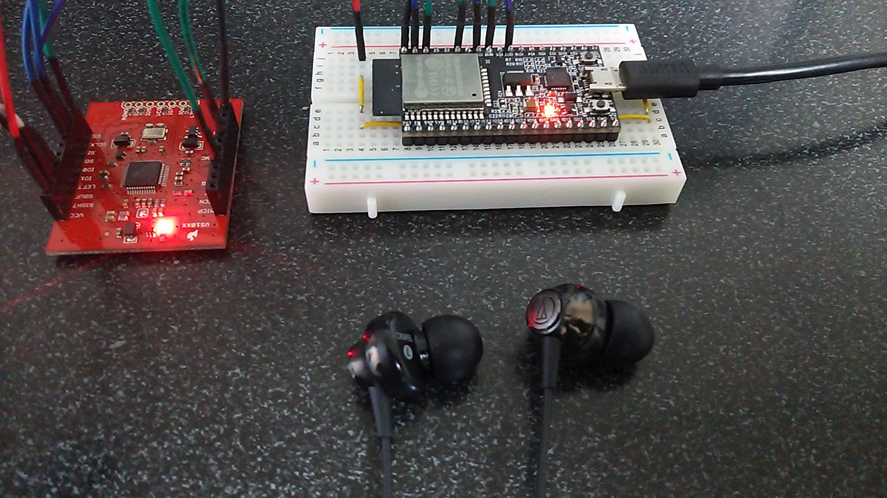
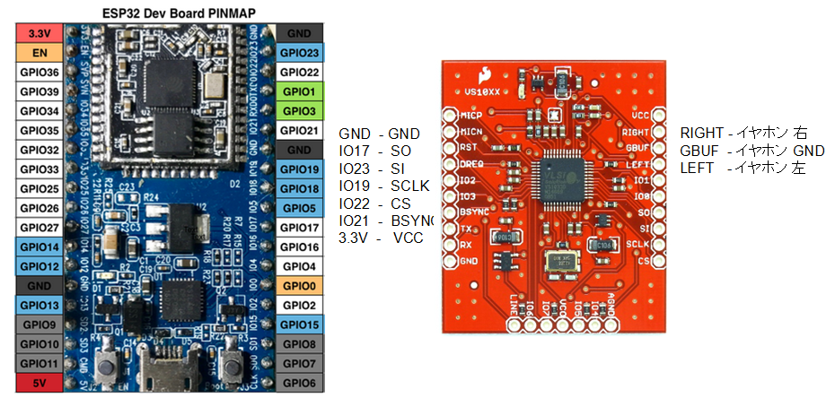

# esp32_BT_Speaker

## Prepare
- [ESP32-DevKitC](http://akizukidenshi.com/catalog/g/gM-11819/) ESP32 : 秋月電子
- MP3 Decoder board using VS1033：Switch Science (End of sale)

## Wiring

## Development Environment
- [esp-idf](https://github.com/espressif/esp-idf)

## Instruction
Options choose step:
 1. make menuconfig.
 2. enter menuconfig "Component config", choose "Bluetooth"
 3. enter menu Bluetooth, choose "Classic Bluetooth" and do not choose "Release DRAM from Classic BT controller"
 4. choose your options.

After the program started, other bluetooth devices such as smart phones can discover this device named "ESP_SPEAKER", and after connection is established, audio data can be transmitted and sound.
